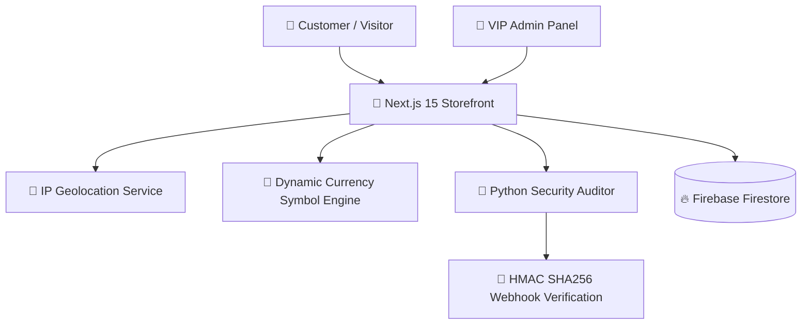

<div align="center">

# 👑 ZAITX MEDIA — Primary Production System

<p align="center">
  <a href="https://zaitxmedia.com">
    
  </a>
  <a href="https://github.com/mohamed-zaitoon/zaitxmedia">
    
  </a>
</p>

<p align="center">
  
  
  
  
  
  
</p>

### 👑 State-of-the-Art Digital Storefront & Multi-Currency Platform
**Luxury Gold & Obsidian Dark Design • Real-time Location Verification • Automated Python Security Auditor**

---

</div>

## 🌓 Dark & Light Mode Adaptive Theme

This repository is optimized for both **Dark Mode** and **Light Mode** viewing on GitHub:

<picture>
  <source media="(prefers-color-scheme: dark)" srcset="https://raw.githubusercontent.com/mohamed-zaitoon/zaitxmedia/main/public/favicon.ico">
  <source media="(prefers-color-scheme: light)" srcset="https://raw.githubusercontent.com/mohamed-zaitoon/zaitxmedia/main/public/favicon.ico">
  
</picture>

- 🌙 **Dark Mode (Default)**: Deep Obsidian Black (`#060a12`), Warm Rich Gold accents (`#f59e0b`), Crisp White text (`#ffffff`).
- ☀️ **Light Mode**: High-contrast Gold-bordered elements with crisp readability.

---

## 🌟 Key Features

### 1. 🔣 Universal Dynamic Currency Symbols Engine
- Real-time symbol mapping for **`£`** (EGP), **`﷼`** (SAR), and **`$`** (USD).
- Bidi-aware LTR numeric formatting: **`45.27 ﷼`** / **`100 £`** / **`10.50 $`**.
- Automatic dynamic conversion via `useCurrency()` hook connected live to Firestore settings.

### 2. 📍 Physical Real-time Geolocation Verification
- Detects user's actual physical country via IP geolocation APIs (`ipapi.co` / `ip-api.com`).
- Rejects unauthorized location switching if physical IP location does not match selected country:
  > `تعذر تغيير الدولة: موقعك الجغرافي الفعلي (مصر 🇪🇬) لا يطابق الدولة المختارة (السعودية 🇸🇦) 📍`

### 3. 🐍 Python Security & System Auditor
- Embedded Python security suite (`scripts/security_auditor.py`).
- Automated HMAC SHA-256 webhook signature validation and environment security checks.
- Python database seeder script for clean zero-data templates (`scripts/reset_example_database.py`).

### 4. 👑 Luxury VIP Admin Panel
- **Non-overlapping Sticky Top Save Bar**: Luxury gold save header (`sticky top-2`) that never collides with card action buttons.
- **Bottom-to-Top Mobile Menu Drawer**: Smooth bottom sheet drawer popping up from bottom of screen on mobile devices.
- **2-Column Quick Action Control Hub**: Spacious control dashboard with large thick luxury buttons.

---

## 🛠️ Architecture & Tech Stack



| Layer | Technology | Description |
| :--- | :--- | :--- |
| **Frontend** | **Next.js 15 (React 19)** | App Router, Server & Client Components |
| **Styling** | **Vanilla CSS + TailwindCSS** | Gold `#f59e0b`, Obsidian `#060a12`, White `#ffffff` |
| **Language** | **TypeScript 5.0** | Strict mode, zero build errors |
| **Backend & Security** | **Python 3.11 + Node.js** | Security auditor scripts, HMAC verification |
| **Database** | **Firebase Firestore** | Real-time listeners for rates and settings |
| **Deployment** | **Vercel Production** | High availability production deployment |

---

## 🚀 Quick Setup Guide

### 1. Clone & Install
```bash
git clone https://github.com/mohamed-zaitoon/zaitxmedia.git
cd zaitxmedia
npm install
```

### 2. Run Python Security Auditor
```bash
python3 scripts/security_auditor.py
```

### 3. Start Local Development Server
```bash
npm run dev
```

---

<div align="center">

**Developed with ❤️ by Mohamed Zaitoon & Antigravity AI Team**

[](https://zaitxmedia.com)

</div>